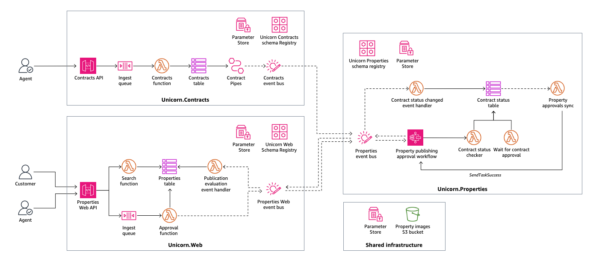

# AWS Serverless Developer Experience workshop reference architecture (Java)

This repository contains the reference architecture for the AWS Serverless Developer Experience workshop.

The AWS Serverless Developer Experience workshop provides you with an immersive experience as a serverless developer. The goal of this workshop is to provide you with hands-on experience building a serverless solution using the [**AWS Serverless Application Model (AWS SAM)**](https://aws.amazon.com/serverless/sam/) and **AWS SAM CLI**.

Along the way, you will learn about principals of distributed event-driven  architectures, messaging patterns, orchestration, and observability and how to apply them in code. You will explore exciting open-source tools, the core features of Powertools for AWS Lambda, and simplified CI/CD deployments supported by AWS SAM Pipelines.

At the end of this workshop, you will be familiar with Serverless developer workflows and microservice composition using AWS SAM, Serverless development best practices, and applied event-driven architectures.

## Introducing the Unicorn Properties architecture

Our use case is based on a real estate company called **Unicorn Properties**.

As a real estate agency, **Unicorn Properties** needs to manage the publishing of new property listings and sale contracts linked to individual properties, and provide a way for their customers to view approved property listings.

To support their needs, Unicorn Properties have adopted a serverless, event-driven approach to designing their architecture. This architecture is centred around two primary domains: **Contracts** (managed by the Contracts Service) and **Properties** (managed by the Web and Properties Services).

The **Unicorn Contracts** service (namespace: `Unicorn.Contracts`) is a simplified service that manages the contractual relationship between a seller of a property and Unicorn Properties. Contracts are drawn up that define the property for sale, the terms and conditions that Unicorn Properties sets, and how much it will cost the seller to engage the services of the agency.

The **Unicorn Web** (namespace: `Unicorn.Web`) manages the details of a property listing to be published on the Unicorn Properties website. Every property listing has an address, a sale price, a description of the property, and some photos that members of the public can look at to get them interested in purchasing the property. Only properties that have been approved for publication can be made visible to the public.

The **Unicorn Properties** service (namespace: `Unicorn.Properties`) approves a property listings. This service implements a workflow that checks for the existence of a contract, makes sure that the content and the images are safe to publish, and finally checks that the contract has been approved. We don’t want to publish a property until we have an approved contract!

Have a go at building this architecture yourself! Head over to the [Serverless Developer Experience Workshop](https://catalog.workshops.aws/serverless-developer-experience) for more details.

## Credits

Throughout this workshop we wanted to introduce you to some Open Source tools that can help you build serverless applications. This is not an exhaustive list, just a small selection of what we will be using in the workshop.

Many thanks to all the AWS teams and community builders who have contributed to this list:

| Tools                    | Description                                                                                                                        | Download / Installation Instructions           |
| ------------------------ | ---------------------------------------------------------------------------------------------------------------------------------- | ---------------------------------------------- |
| cfn-lint                 | Validate AWS CloudFormation yaml/json templates against the AWS CloudFormation Resource Specification and additional checks.       | https://github.com/aws-cloudformation/cfn-lint |
| cfn-lint-serverless      | Compilation of rules to validate infrastructure-as-code templates against recommended practices for serverless applications.       | https://github.com/awslabs/serverless-rules    |
| @mhlabs/iam-policies-cli | CLI for generating AWS IAM policy documents or SAM policy templates based on the JSON definition used in the AWS Policy Generator. | https://github.com/mhlabs/iam-policies-cli     |
| @mhlabs/evb-cli          | Pattern generator and debugging tool for Amazon EventBridge                                                                        | https://github.com/mhlabs/evb-cli              |
